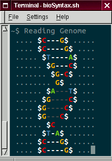

# The Laboratory for RNA-Based Lifeforms

<div style="text-align:center">
	<a href="drawHelix.sh"> </a>
</div>

## Local development

Install ruby and compiler with conda

```
conda install -c conda-forge ruby
conda install -c conda-forge compilers
```

Install gem bundler if missing

```
gem list bundler
gem install bundler
```

Install gem packages and serve Jekyll web site

```
bundle install
bundle exec jekyll serve
```
